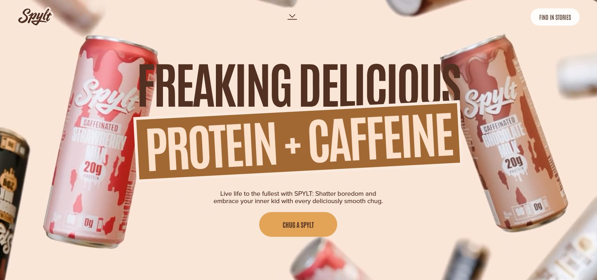

<h3>Project: SPLYT Drink Clone: Next-Level Web Animation with GSAP</h3>

<b>Used Language/Library/Frameworks/Tools (Frontend Project):</b> HTML5, CSS3, Tailwind CSS, GSAP, React, Typescript, Vercel, Github, Git

<h4>Overview:</h4>

This project is a high-performance, pixel-perfect frontend clone of the sleek SPLYT Drink website, meticulously engineered to showcase advanced web animation and scroll-driven storytelling. It serves as a masterclass in utilizing the GreenSock Animation Platform (GSAP) to create an immersive, butter-smooth, and performance-optimized user experience.

<b>Next-Level Web Animation with GSAP Live Link: </b><a href="https://spylt-gsap-animated-clone.vercel.app/">Click Here</a> 
 

